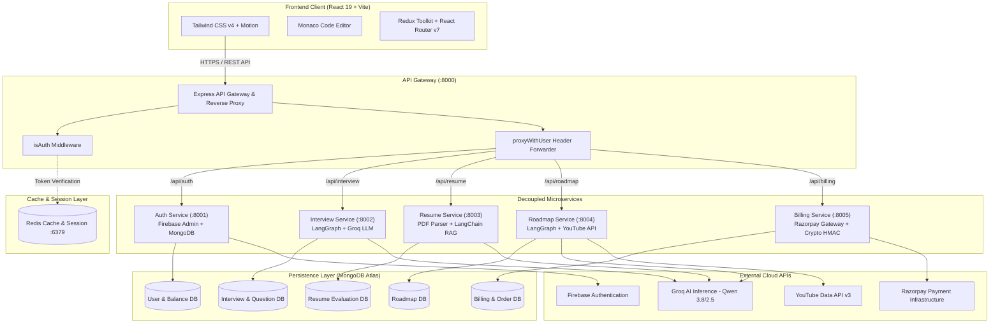
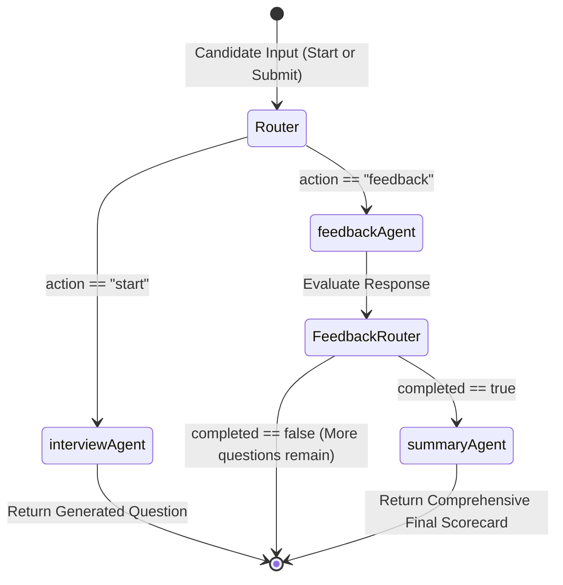
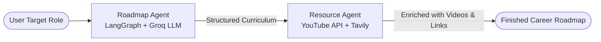

# 🚀 FirstHireAI — Next-Gen AI Career Acceleration Platform

[](https://react.dev/)
[](https://vitejs.dev/)
[](https://nodejs.org/)
[](https://expressjs.com/)
[](https://langchain-ai.github.io/langgraph/)
[](https://groq.com/)
[](https://www.mongodb.com/)
[](https://redis.io/)
[](https://www.docker.com/)
[](https://razorpay.com/)

**FirstHireAI** is an enterprise-ready, microservices-driven AI career preparation platform designed to bridge the gap between job seekers and competitive industry standards. By pairing multi-agent AI systems, real-time code execution interfaces, applicant tracking system (ATS) algorithms, and customized career roadmaps, FirstHireAI simulates human-like interviews and provides actionable feedback.

---

## 📑 Table of Contents

- [The Problem Statement & Problem-Solving Approach](#-the-problem-statement--problem-solving-approach)
  - [The Hiring Landscape Problem](#1-the-hiring-landscape-problem)
  - [FirstHireAI's Strategic Solution](#2-firsthireais-strategic-solution)
- [System Architecture](#-system-architecture)
  - [High-Level Architecture Diagram](#high-level-architecture-diagram)
  - [Service Breakdown](#service-breakdown)
- [Core Features](#-core-features)
  - [1. Dynamic AI Mock Interviews](#1-dynamic-ai-mock-interviews)
  - [2. Intelligent ATS Resume Scorer](#2-intelligent-ats-resume-scorer)
  - [3. ATS-Compliant Resume Builder](#3-ats-compliant-resume-builder)
  - [4. AI-Curated Learning Roadmaps](#4-ai-curated-learning-roadmaps)
  - [5. Performance Analytics Dashboard](#5-performance-analytics-dashboard)
  - [6. Credit & Billing Ecosystem](#6-credit--billing-ecosystem)
- [Tech Stack](#-tech-stack)
- [Agentic AI Architecture & Workflows](#-agentic-ai-architecture--workflows)
- [Database Schema & State Management](#-database-schema--state-management)
- [Repository Structure](#-repository-structure)
- [Environment Variables](#-environment-variables)
- [Step-by-Step Setup Guide](#-step-by-step-setup-guide)
  - [Prerequisites](#prerequisites)
  - [Method 1: Docker Compose (Recommended)](#method-1-docker-compose-recommended)
  - [Method 2: Unified Script (Local Shell)](#method-2-unified-script-local-shell)
  - [Method 3: Standalone Microservices (Developer Mode)](#method-3-standalone-microservices-developer-mode)
- [API Gateway Reference](#-api-gateway-reference)
- [Deployment Guide](#-deployment-guide)
- [Contributing](#-contributing)
- [License](#-license)

---

## 🎯 The Problem Statement & Problem-Solving Approach

### 1. The Hiring Landscape Problem

The contemporary recruitment pipeline presents major challenges for candidates:

1. **The "ATS Black Hole"**: Over 75% of resumes are discarded by Applicant Tracking Systems before reaching human recruiters due to improper parsing formatting, missing semantic keywords, or misaligned experience descriptions.
2. **Interview Anxiety and Lack of Real-Time Practice**: Candidates rarely receive genuine technical or behavioral interview practice with instant, candid feedback. Traditional mock interviews with human mentors are either cost-prohibitive or hard to schedule.
3. **Absence of Synchronous Technical Evaluation**: Most prep resources provide static LeetCode-style questions without conversational follow-ups, reasoning probes, or holistic code-evaluation metrics that mirror real FAANG/tier-1 technical rounds.
4. **Overwhelming, Fragmented Learning Paths**: Aspiring developers struggle to identify exact industry-relevant skills. They often get stuck in tutorial loops without structured, milestone-based curricula or curated educational material.

### 2. FirstHireAI's Strategic Solution

FirstHireAI addresses these hurdles through a unified, stateful AI platform:

```
[Candidate Ingestion] ➡️ [AI Diagnostic Profiling] ➡️ [Targeted Practice & Roadmapping] ➡️ [Job Readiness]
        │                           │                                │                            │
  Upload Resume             ATS Scoring & Gaps            Adaptive Mock Interviews           Verified Skills
   or Build ATS             Missing Tech Skills            Live Monaco Code Editor            Detailed Reports
```

- **Graph-Based Adaptive Interviews**: Instead of static prompt-response templates, the platform uses stateful **LangGraph** workflows. The AI tracks conversational turns, assesses answers on technical correctness, depth, and communication, and generates adaptive follow-ups or code challenges tailored to candidate responses.
- **Deep Semantic Resume Intelligence**: Utilizes document extraction, LLM parsing, and vector embeddings (Qdrant & LangChain) to score resumes against recruiter criteria, spotlighting missing skills and format risks.
- **Automated Curriculum Synthesis**: Combines LLM planning agents with the **YouTube Data API** and **Tavily Search** to compile real-time, milestone-driven learning paths paired with verified video courses.
- **Decoupled Microservice Architecture**: Each functional pillar (Auth, Interview, Resume, Roadmap, Billing) is isolated into its own autonomous service behind a centralized API Gateway, ensuring zero cascade failures, low latency, and horizontal scalability.
- **Accessible Coin-Based Monetization**: Lowers financial barriers by giving all new signups 150 complimentary coins and providing micro-transaction top-ups via **Razorpay**.

---

## 🏗️ System Architecture

### High-Level Architecture Diagram



### Service Breakdown

| Service | Port | Primary Responsibilities | Core Dependencies |
| :--- | :--- | :--- | :--- |
| **API Gateway** | `8000` | Unified entry point, route reverse proxying, CORS policy, cookie parsing, authentication verification, user identity header enrichment (`x-user-id`, `x-user-email`). | `express`, `express-http-proxy`, `cors`, `cookie-parser`, `ioredis` |
| **Auth Service** | `8001` | User registration, Firebase ID token exchange, Google OAuth session handling, welcome coin allocation (150 coins), user profile updates. | `firebase-admin`, `mongoose`, `cookie-parser`, `crypto` |
| **Interview Service** | `8002` | Adaptive mock interview sessions, live question evaluation, multi-agent state graph orchestration, response scoring, comprehensive candidate report synthesis. | `@langchain/langgraph`, `@langchain/groq`, `mongoose` |
| **Resume Service** | `8003` | Resume PDF upload via Multer, semantic document extraction (`pdf-parse`), ATS ranking, strengths/weaknesses gap detection, vector embeddings. | `pdf-parse`, `@langchain/groq`, `@langchain/google-genai`, `multer` |
| **Roadmap Service** | `8004` | Career journey generator, curriculum milestone structuring, real-time YouTube tutorial integration via Google Data API, Tavily internet research. | `@langchain/langgraph`, `@langchain/groq`, `@langchain/tavily`, `axios` |
| **Billing Service** | `8005` | Payment order creation, Razorpay checkout hooks, cryptographic HMAC SHA256 signature verification, instant credit disbursement. | `razorpay`, `mongoose`, `crypto` |
| **Frontend Client** | `5173` / `80` | High-performance responsive single-page web app, Monaco interactive code editor, real-time progress indicators, radar and history charts. | `react 19`, `vite`, `tailwindcss v4`, `motion`, `@monaco-editor/react`, `recharts` |

---

## ✨ Core Features

### 1. Dynamic AI Mock Interviews
- **Role & Experience Customization**: Select target job profiles (Frontend, Backend, Fullstack, AI/ML, DevOps, Data Analyst) and seniority levels (Entry, Mid, Senior) along with custom tech stacks.
- **Dual Interview Tracks**: Choose between deep **Technical** rounds (coding, system design, architectural concepts) and **Behavioral/HR** rounds (situational scenarios, culture fit, STAR framework).
- **Embedded Monaco Code Editor**: Write, test, and submit code in JavaScript, Python, C++, Java, and Go with syntax highlighting, line numbers, and theme toggling.
- **Audio-Visual Simulation**: Built-in webcam preview and microphone controls to recreate the physical interview environment and help candidates manage interview stress.
- **Instant Turn-by-Turn Feedback**: Each submitted answer receives instant constructive critiques, numerical accuracy ratings, highlighting strengths and missing knowledge points.
- **In-Depth Diagnostic Scorecard**: Comprehensive summary report at the end of the interview detailing overall score, technical aptitude, behavioral clarity, radar performance breakdowns, and clear next steps.

### 2. Intelligent ATS Resume Scorer
- **Multi-Format Ingestion**: Drag-and-drop or select any PDF resume for immediate analysis.
- **0–100 ATS Compatibility Index**: Evaluates document formatting, keyword density, section structuring, and actionable achievement metrics.
- **Skills Gap Analysis**: Pinpoints essential missing technical skills, outdated terminology, or non-ATS compliant layout issues.
- **Target Role Recommendation**: AI reads current experience and identifies matching market job roles.

### 3. ATS-Compliant Resume Builder
- **Structured Step-by-Step Forms**: Real-time form fields covering personal info, professional summaries, work experience, projects, education, and technical competencies.
- **Live Side-by-Side Preview**: Instantly watch the resume update as you type.
- **Machine-Friendly Layout**: Formatted according to modern ATS best practices (single column, parseable headers, bullet points).
- **Single-Click PDF Export**: Uses client-side `html2canvas`, `jspdf`, and `react-to-print` for pixel-perfect PDF downloads.

### 4. AI-Curated Learning Roadmaps
- **Custom Milestone Generation**: Input any target job title or specialization to generate a sequential curriculum divided into modules.
- **Integrated Video Tutorials**: Connects to the **YouTube Data API v3** to attach curated video tutorials, playlists, and documentation for every module.
- **Interactive Checklists**: Mark topics as completed to track progress over weeks and months.

### 5. Performance Analytics Dashboard
- **Aggregate Metric Cards**: Track total interviews created, questions attempted, completed sessions, and overall average score.
- **Performance History Graphs**: Interactive charts built with **Recharts** displaying candidate score trends over time across technical and behavioral sessions.
- **Session History List**: Review historical interviews and revisit generated feedback reports.

### 6. Credit & Billing Ecosystem
- **Complimentary Welcome Balance**: 150 coins credited on account creation to allow immediate mock interviews and resume checks.
- **Razorpay Integration**: Secure checkout with webhook validation for instant credit top-ups (e.g., Starter Tier: 300 Coins, unlimited roadmaps and scoring).
- **Wallet Transparency**: Live coin balances displayed in the user profile and sidebar.

---

## 🛠️ Tech Stack

| Domain | Technologies |
| :--- | :--- |
| **Frontend Framework** | React 19, Vite 8, React Router DOM 7 |
| **State & Data Management** | Redux Toolkit (`@reduxjs/toolkit`), Axios, Context API |
| **Styling & Motion** | Tailwind CSS v4, Motion (Framer Motion v12), React Icons |
| **Code Editor & Visuals** | Monaco Editor (`@monaco-editor/react`), Recharts, React Circular Progressbar |
| **Document Processing** | `pdf-parse`, `jspdf`, `html2canvas`, `react-to-print` |
| **Backend Runtime** | Node.js (ES Modules), Express.js 5.x |
| **Microservice Gateway** | `express-http-proxy`, `cors`, `morgan`, `cookie-parser` |
| **Agentic AI & LLMs** | LangGraph, LangChain Core, Groq SDK (`qwen/qwen3.8-27b`), Google Generative AI |
| **Databases & Cache** | MongoDB Atlas, Mongoose 9.x, Redis (via `ioredis`) |
| **Authentication** | Firebase Admin SDK, Firebase Web Client, Cookie-based sessions |
| **Payments** | Razorpay Node.js SDK, Web Checkout, Node.js Crypto (HMAC SHA-256) |
| **DevOps & Containers** | Docker, Docker Compose, Render (`render.yaml`) |

---

## 🤖 Agentic AI Architecture & Workflows

FirstHireAI relies on **LangGraph** stateful graphs to manage complex, multi-step conversational interactions rather than basic single-shot prompts.

### 1. Interview Service State Graph



- **`InterviewState`**: Manages the conversation history, role, skill requirements, current question index, question list, user answers, feedback logs, and completion flags.
- **`interviewAgent`**: Formulates role-appropriate questions, introduces follow-ups based on earlier replies, and sets up programming prompts.
- **`feedbackAgent`**: Evaluates candidate answers against expected technical accuracy, assigns numerical scores, notes strengths, and suggests improvements.
- **`summaryAgent`**: Compiles all question-answer cycles into an overall competency report.

### 2. Roadmap Service Multi-Agent Workflow



- **`roadmapAgent`**: Designs the learning path, separating prerequisites, core fundamentals, and advanced topics.
- **`resourceAgent`**: Queries the YouTube Data API to pull top-rated video playlists and tutorials matching each specific milestone.

---

## 🗄️ Database Schema & State Management

FirstHireAI connects to specialized MongoDB database instances across microservices:

```
MongoDB Cluster
 ├── User (auth-service)
 │    ├── name, email, avatar, firebaseUid
 │    ├── coinsBalance (default: 150)
 │    └── timestamps
 ├── interviewStart (interview-service)
 │    ├── userId, role, track (technical / behavioural), experience
 │    ├── questions: [ { question, answer, code, feedback, score } ]
 │    ├── overallScore, technicalScore, communicationScore
 │    └── isCompleted
 ├── Resume (resume-service)
 │    ├── userId, originalFileName
 │    ├── parsedData: { name, email, skills, experience, education, projects }
 │    ├── atsScore, strengths, weaknesses, missingSkills, suggestedRole
 │    └── createdAt
 ├── Roadmaps (roadmap-service)
 │    ├── userId, role, targetDuration
 │    ├── modules: [ { title, description, resources: [ { title, url, type } ] } ]
 │    └── timestamps
 └── billing (billing-service)
      ├── userId, orderId, paymentId, signature
      ├── planId, amount, coinsAdded, status
      └── createdAt
```

---

## 📂 Repository Structure

```
FirstHireAI/
├── .env.example                       # Root environment template
├── docker-compose.yml                 # Multi-container orchestration specification
├── render.yaml                        # Infrastructure-as-code blueprint for Render
├── backend/
│   ├── Dockerfile.render              # Unified multi-service container build for cloud hosting
│   ├── package.json                   # Shared backend tools & ioredis
│   ├── start.sh                       # Multi-service launcher script
│   ├── gateway/                       # Central API Gateway (:8000)
│   │   ├── Dockerfile
│   │   ├── index.js                   # Proxy routing & CORS configuration
│   │   ├── middlewares/isAuth.js      # Redis & session authentication validation
│   │   └── utils/proxyWithHeaders.js  # Identity forwarding helper
│   ├── shared/
│   │   └── redis/redis.js             # Resilient Redis connection utility (supports Upstash/TLS)
│   └── services/
│       ├── auth-service/              # User identity & Firebase verification (:8001)
│       │   ├── Dockerfile
│       │   ├── index.js
│       │   └── serviceAccountKey.json # (Mounted via volume or injected at runtime)
│       ├── interview-service/         # LangGraph mock interview state machine (:8002)
│       │   ├── Dockerfile
│       │   ├── agents/                # Interview, Feedback & Summary LLM nodes
│       │   ├── graph/                 # StateGraph compiled workflows
│       │   └── index.js
│       ├── resume-service/            # Resume parser & ATS evaluator (:8003)
│       │   ├── Dockerfile
│       │   ├── agents/                # ATS evaluation agents
│       │   └── index.js
│       ├── roadmap-service/           # Career roadmaps & YouTube resource curator (:8004)
│       │   ├── Dockerfile
│       │   ├── agents/                # Roadmap & Resource research agents
│       │   └── index.js
│       └── billing-service/           # Razorpay order creation & signature verification (:8005)
│           ├── Dockerfile
│           └── index.js
└── frontend/                          # React 19 Client SPA (:5173 / :80)
    ├── Dockerfile                     # Multi-stage production Nginx container
    ├── package.json
    ├── vite.config.js
    └── src/
        ├── App.jsx                    # Routing table & root layout
        ├── api/                       # Service-specific Axios API connectors
        ├── components/
        │   ├── Sidebar.jsx            # Main navigational drawer & coin counter
        │   ├── Statbox.jsx            # KPI cards
        │   ├── InterviewGraph.jsx     # Historical trend visualizers
        │   ├── interview/             # Monaco code editor, timers, setup wizards
        │   ├── resume/                # Live ATS templates & print/download handlers
        │   └── roadmap/               # Module checklists & video embeds
        └── pages/
            ├── Home.jsx               # Landing page & feature showcase
            ├── Dashbord.jsx           # Performance overview
            ├── InterviewPage.jsx      # Live interview workspace
            ├── Scorer.jsx             # ATS resume evaluation tool
            ├── ResumeBuilder.jsx      # Interactive resume builder
            ├── Roadmap.jsx            # Career pathway explorer
            └── Pricing.jsx            # Coin purchase cards & checkout
```

---

## 🔑 Environment Variables

To operate the platform, each component requires specific environment configurations. Create a `.env` file within the respective folders based on the templates below.

### 1. Root `.env` (Used for Docker Compose builds)
```env
VITE_RAZORPAY_KEY_ID="rzp_test_your_key_id"
VITE_FIREBASE_APIKEY="your_firebase_web_api_key"
```

### 2. Frontend (`frontend/.env`)
```env
VITE_FIREBASE_APIKEY="your_firebase_web_api_key"
VITE_RAZORPAY_KEY_ID="rzp_test_your_key_id"
```

### 3. API Gateway (`backend/gateway/.env`)
```env
PORT=8000
AUTH_SERVICE_URL="http://127.0.0.1:8001"
INTERVIEW_SERVICE_URL="http://127.0.0.1:8002"
RESUME_SERVICE_URL="http://127.0.0.1:8003"
ROADMAP_SERVICE_URL="http://127.0.0.1:8004"
BILLING_SERVICE_URL="http://127.0.0.1:8005"
REDIS_URL="redis://127.0.0.1:6379"
CLIENT_URL="http://localhost:5173"
```
*(Note: When using Docker Compose, change `127.0.0.1` to the container hostnames: `http://auth-service:8001`, `http://interview-service:8002`, etc., and `redis://redis:6379`)*

### 4. Auth Service (`backend/services/auth-service/.env`)
```env
PORT=8001
MONGODB_URL="mongodb+srv://<user>:<password>@cluster.mongodb.net/User"
REDIS_URL="redis://127.0.0.1:6379"
```
> **Security Note:** Place your Firebase Admin credentials in `backend/services/auth-service/serviceAccountKey.json`.

### 5. Interview Service (`backend/services/interview-service/.env`)
```env
PORT=8002
MONGODB_URL="mongodb+srv://<user>:<password>@cluster.mongodb.net/interviewStart"
REDIS_URL="redis://127.0.0.1:6379"
GROQ_API_KEY="gsk_your_groq_api_key"
GROQ_MODEL="qwen/qwen3.8-27b"
```

### 6. Resume Service (`backend/services/resume-service/.env`)
```env
PORT=8003
MONGODB_URL="mongodb+srv://<user>:<password>@cluster.mongodb.net/Resume"
REDIS_URL="redis://127.0.0.1:6379"
GROQ_API_KEY="gsk_your_groq_api_key"
GROQ_MODEL="qwen/qwen3.8-27b"
```

### 7. Roadmap Service (`backend/services/roadmap-service/.env`)
```env
PORT=8004
MONGODB_URL="mongodb+srv://<user>:<password>@cluster.mongodb.net/Roadmaps"
REDIS_URL="redis://127.0.0.1:6379"
GROQ_API_KEY="gsk_your_groq_api_key"
GROQ_MODEL="qwen/qwen3.8-27b"
YOUTUBE_API_KEY="your_google_youtube_data_api_v3_key"
```

### 8. Billing Service (`backend/services/billing-service/.env`)
```env
PORT=8005
MONGODB_URL="mongodb+srv://<user>:<password>@cluster.mongodb.net/billing"
REDIS_URL="redis://127.0.0.1:6379"
RAZORPAY_KEY_ID="rzp_test_your_key_id"
RAZORPAY_KEY_SECRET="your_razorpay_secret_key"
```

---

## 🚀 Step-by-Step Setup Guide

### Prerequisites

Ensure you have the following installed on your machine:
- **Node.js**: `v20.x` or higher
- **npm**: `v10.x` or higher
- **Docker & Docker Compose**: (Required for Method 1)
- **Redis**: Local daemon or free cloud instance from [Upstash](https://upstash.com/)
- **MongoDB Atlas**: Free cluster with connection URI
- **API Keys**:
  - [Groq Cloud Console](https://console.groq.com/) (LLM inference)
  - [Firebase Console](https://console.firebase.google.com/) (Authentication & service account JSON)
  - [Google Cloud Console](https://console.cloud.google.com/) (YouTube Data API v3 enabled)
  - [Razorpay Dashboard](https://dashboard.razorpay.com/) (Test mode Key & Secret)

---

### Method 1: Docker Compose (Recommended)

Run the entire platform (Redis, all 5 backend microservices, API Gateway, and Frontend container) with a single command:

1. **Clone the repository**:
   ```bash
   git clone https://github.com/techAbhiCode/FirstHireAI.git
   cd FirstHireAI
   ```

2. **Configure Root Environment Variables**:
   Copy `.env.example` to `.env` and fill in your keys:
   ```bash
   cp .env.example .env
   ```

3. **Verify Firebase Service Account**:
   Ensure `serviceAccountKey.json` is located in `backend/services/auth-service/serviceAccountKey.json`.

4. **Build and start all containers**:
   ```bash
   docker compose up --build -d
   ```

5. **Verify Running Containers**:
   ```bash
   docker compose ps
   ```

6. **Access the Application**:
   - **Frontend App**: `http://localhost` (or `http://localhost:80`)
   - **API Gateway**: `http://localhost:8000`
   - **Redis**: `localhost:6379`

---

### Method 2: Unified Script (Local Shell)

If you are running on a Linux/macOS environment (or Windows with Git Bash / WSL) and already have a local or Upstash Redis instance running:

1. **Install Dependencies across all packages**:
   ```bash
   # Root backend
   cd backend && npm install

   # Services
   cd services/auth-service && npm install && cd ../..
   cd services/interview-service && npm install && cd ../..
   cd services/resume-service && npm install && cd ../..
   cd services/roadmap-service && npm install && cd ../..
   cd services/billing-service && npm install && cd ../..
   cd gateway && npm install && cd ..
   ```

2. **Run the Unified Launcher**:
   Make `start.sh` executable and run it:
   ```bash
   chmod +x start.sh
   ./start.sh
   ```
   *This starts all 5 microservices in the background on ports 8001–8005 and binds the API Gateway to port 8000.*

3. **Start the Frontend**:
   In another terminal:
   ```bash
   cd frontend
   npm install
   npm run dev
   ```
   Open `http://localhost:5173`.

---

### Method 3: Standalone Microservices (Developer Mode)

For debugging or developing on an individual microservice:

1. **Start Redis**:
   ```bash
   docker run -d --name redis -p 6379:6379 redis:alpine
   ```

2. **Launch each service in separate terminals**:

   ```bash
   # Terminal 1: Auth Service
   cd backend/services/auth-service
   npm run dev

   # Terminal 2: Interview Service
   cd backend/services/interview-service
   npm run dev

   # Terminal 3: Resume Service
   cd backend/services/resume-service
   npm run dev

   # Terminal 4: Roadmap Service
   cd backend/services/roadmap-service
   npm run dev

   # Terminal 5: Billing Service
   cd backend/services/billing-service
   npm run dev

   # Terminal 6: API Gateway
   cd backend/gateway
   npm run dev

   # Terminal 7: Frontend Web App
   cd frontend
   npm run dev
   ```

---

## 🌐 API Gateway Reference

All client network requests pass through the unified API Gateway at `http://localhost:8000`.

| Route Pattern | Target Service | Auth Required | Description |
| :--- | :--- | :---: | :--- |
| `GET /` | API Gateway | No | Gateway health check. |
| `/api/auth/*` | Auth Service (`:8001`) | No | Registration, login, Google OAuth verification, logout. |
| `GET /api/me` | API Gateway / Controller | **Yes** | Returns authenticated user identity, coins balance, and metadata. |
| `/api/interview/*` | Interview Service (`:8002`) | **Yes** | Start mock interview, submit turn responses, retrieve evaluations and reports. |
| `/api/resume/*` | Resume Service (`:8003`) | **Yes** | Upload resume PDF, trigger ATS parsing, compute keyword scores and gaps. |
| `/api/roadmap/*` | Roadmap Service (`:8004`) | **Yes** | Generate customized career roadmaps, query YouTube tutorials. |
| `/api/billing/*` | Billing Service (`:8005`) | **Yes** | Create Razorpay payment orders, verify HMAC signatures, disburse coins. |

> **Header Propagation**: The gateway intercepts validated sessions and appends authenticated user details into downstream request headers (`x-user-id`, `x-user-email`) before proxying.

---

## ☁️ Deployment Guide

### Deploying on Render (Unified Cloud Container)

The repository provides a `render.yaml` configuration and `Dockerfile.render` that packages all microservices into a single multi-process deployment:

1. Fork or push your code to GitHub.
2. Link the repository in your [Render Dashboard](https://dashboard.render.com/).
3. Choose **Blueprint** deployment (Render will read `render.yaml`).
4. Set the following environment variables in the Render console:
   - `MONGODB_URL`: Your MongoDB Atlas cluster connection string.
   - `REDIS_URL`: Your Redis connection string (e.g., from Upstash).
   - `GROQ_API_KEY`: Groq Cloud API key.
   - `YOUTUBE_API_KEY`: Google Cloud YouTube Data API key.
   - `RAZORPAY_KEY_ID` & `RAZORPAY_KEY_SECRET`: Razorpay credentials.
   - `CLIENT_URL`: Your production frontend URL (e.g. `https://firsthireai.vercel.app`).
   - `FIREBASE_SERVICE_ACCOUNT`: Stringified content of your `serviceAccountKey.json`.

### Deploying the Frontend on Vercel
1. Import the `frontend` folder into [Vercel](https://vercel.com).
2. Configure Environment Variables:
   - `VITE_FIREBASE_APIKEY`: Your Firebase web client key.
   - `VITE_RAZORPAY_KEY_ID`: Your public Razorpay key ID.
3. Deploy! The included `vercel.json` ensures client-side routing is handled automatically.

---

## 🤝 Contributing

Contributions to FirstHireAI are welcome. To get started:

1. **Fork the Repository** on GitHub.
2. **Create a Feature Branch**:
   ```bash
   git checkout -b feature/NewFeatureName
   ```
3. **Commit your changes**:
   ```bash
   git commit -m "Add: Implement adaptive coding problem generator"
   ```
4. **Push to your Branch**:
   ```bash
   git push origin feature/NewFeatureName
   ```
5. **Open a Pull Request** describing your changes and testing steps.

---

## 📄 License

This project is licensed under the **ISC License**. Feel free to use, modify, and distribute it in accordance with the license conditions.

---

<p align="center">
  <b>Built for modern job seekers. Accelerate your career with FirstHireAI.</b>
</p>
